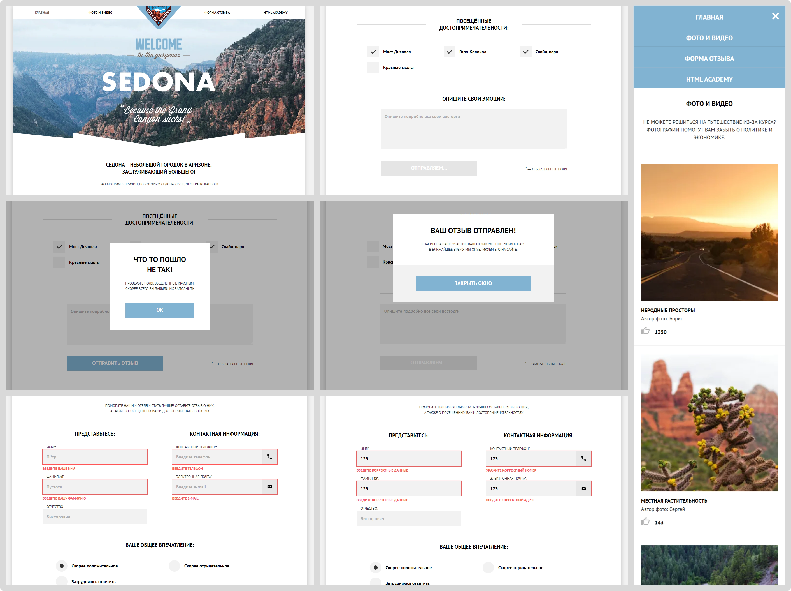

# Седона

[Опубликованная версия🡕]()



## Описание 

Неофициальный сайт, который описывает преимущества путешествия в город Седона в штате Аризона. Пользователи могут просматривать фото- и видеогалерею и делиться впечатлениями.

Макет взят в образовательной платформе [HTML-Academy🡕](https://htmlacademy.ru/study)

:bulb: Проект полностью адаптивен для мобильной / планшетной / десктопной версии.

## :gear: Функциональные возможности 

- Просмотр фото- и ведеогалереи;
- Отправка отзыва;
- Просмотр города на интерактивной карте (использована библиотека [Leaflet🡕](https://leafletjs.com/));
- Валидация формы заказа (выполнена с помощью библиотеки [PristineJS🡕](https://pristine.js.org/));
- Взаимодействие с пользователем: показ сообщений об ошибках и успехе;

## :hammer: Установка и запуск

1. Установка зависимостей:
```Shell
npm ci
```

2. Запуск сборки на локальном сервере:
```Shell
npm run start
```

3. Запуск продакшн-сборки (папка `build`):
```Shell
npm run build
```

## :crystal_ball: Используемые технологии
<table>
  <tr>
    <td width="70" align='center'>
      
      <br>
      <sub>PUG</sub>
    </td>
    <td width="70" align='center'>
      
      <br>
      <sub>SCSS</sub>
    </td>
    <td width="70" align='center'>
      
      <br>
      <sub>JavaScript</sub>
    </td>
    <td width="70" align='center'>
      
      <br>
      <sub>NPM</sub>
    </td>
    <td width="70" align='center'>
      
      <br>
      <sub>GIT</sub>
    </td>
  </tr>
</table>

### Инструменты сборки

<table>
  <tr>
    <td width="70" align='center'>
      
      <br>
      <sub>Webpack</sub>
    </td>
    <td width="70" align='center'>
      
      <br>
      <sub>Autoprefixer</sub>
    </td>
    <td width="70" align='center'>
      
      <br>
      <sub>PostCSS</sub>
    </td>
    <td width="70" align='center'>
      
      <br>
      <sub>Stylelint</sub>
    </td>
    <td width="70" align='center'>
      
      <br>
      <sub>ESLint</sub>
    </td>
  </tr>
</table>

### Сторонние библиотеки

<table>
  <tr>
    <td width="70" align='center'>
      
      <br>
      <sub>PristineJS</sub>
    </td>
    <td width="70" align='center'>
      
      <br>
      <sub>Leaflet</sub>
    </td>
  </tr>
</table>

### Методологии

<table>
  <tr>
    <td width="70" align='center'>
      
      <br>
      <sub>БЭМ</sub>
    </td>
  </tr>
</table>

## :game_die: Архитектура

### Шаблонизатор Pug

- Создание более структурированого HTML-кода;
- Использование переменных и циклов;
- Переиспользование блоков кода.

### Препроцессор SCSS

- Стили разделены на компоненты;
- Использованы переменные для хранения цветов, шрифтов и других стилевых свойств.

### Webpack-сборка

Инструмент сборки Webpack использован для преобразования препроцессорных файлов в форматы HTML и CSS, для сборки JavaScript-модулей, минификации и оптимизации файлов, запуска локального сервера и т.д.

### ECMAScript-модули

JavaScript-код разделён на модули, каждый из которых отвечает за управление своим функционалом.

### БЭМ-методология

Стили и название классов организованы с использованием БЭМ-нотации.

## :star2: Преимущества

### Оптимизация и производительность

- Файлы, которые попадают в готовую сборку, минифицированы (html, css, js);
- Изображения оптимизированы под стандартную и двойную плотность пикселей;
- Изображения кадрированы с учётом различных размеров экрана мобильных устройств, планшетов и десктопов;
- Использован спрайт для векторных изображений.

### Адаптивность

Выполнена резиновая вёрстка всех состояний страниц: мобильной, планшетной, десктопной.

### Доступность

- Использованы семантичные HTML-теги;
- Использованы ARIA-атрибуты для повышения доступности пользователей с ограниченными возможностями.

### Кроссбраузерность

Вёрстка идентично отображается в последних версиях браузеров (`Chrome`, `Firefox`, `Safari`).

### Pixel Perfect

Веб-страница в браузере выглядит так же, как было задумано дизайнером в графическом редакторе.
